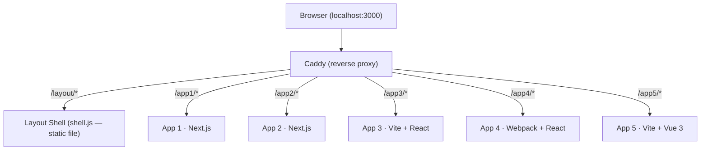

# Microfrontends Demo

A demonstration project showcasing a microfrontend architecture with a shared layout shell. Five independent frontend applications — built with different frameworks — are stitched together behind a single reverse proxy, sharing a common topbar and footer without any runtime coupling between them.

## Architecture



### How it works

Each microfrontend is deployed and served independently. The **Caddy proxy** routes requests by base path to the correct application and serves the compiled layout shell as a plain static file (`/layout/shell.js`).

Every application follows the same integration contract:

1. Renders two DOM elements: `#application-layout` (mount target for the shell) and `#application-content` (the app's own content, initially hidden).
2. Defines `window.__APP_LAYOUT` before `shell.js` is loaded, exposing DOM accessor functions.
3. Loads `shell.js`, which reads `window.__APP_LAYOUT`, moves `#application-content` inside the layout structure, mounts the React topbar and footer into `#application-layout`, then reveals the content.

Because the layout shell is a separately compiled bundle loaded at runtime, it is completely decoupled from each application's build pipeline.

### Applications

| App   | Framework              | Build tool | Route   |
| ----- | ---------------------- | ---------- | ------- |
| App 1 | Next.js (Pages Router) | Next.js    | `/app1` |
| App 2 | Next.js (Pages Router) | Next.js    | `/app2` |
| App 3 | React + React Router   | Vite       | `/app3` |
| App 4 | React + React Router   | Webpack    | `/app4` |
| App 5 | Vue 3 + Vue Router     | Vite       | `/app5` |

## Prerequisites

- [Docker](https://docs.docker.com/get-docker/) / [Podman](https://podman.io/) with Compose support

## Running the project

```bash
# Docker
docker compose up -d --build --wait

# Podman
podman-compose up --build
```

Open [http://localhost:3000](http://localhost:3000).

Use the navigation links in the topbar to switch between applications. The topbar and footer are rendered by the layout shell and persist across navigations without a full page reload.

## Stopping the project

```bash
# Docker
docker compose down

# Podman
podman-compose down
```

To also remove all images and volumes:

```bash
# Docker
docker compose down --rmi all --volumes --remove-orphans

# Podman
podman-compose down --volumes --remove-orphans
podman image prune -a -f
```

## Project structure

```
├── docker-compose.yaml
├── proxy/                          # Caddy reverse proxy + layout static files
│   ├── Dockerfile                  # Multi-stage: builds layout, copies into Caddy image
│   └── Caddyfile                   # Path-based routing rules
├── layout/                         # Shared layout shell → compiled to shell.js
│   ├── src/
│   │   ├── main.tsx                # Reads window.__APP_LAYOUT, mounts React root
│   │   ├── Layout.tsx              # Topbar + footer component
│   │   └── global.d.ts             # TypeScript contract: AppLayoutConfig interface
│   └── vite.config.ts
├── app1/                           # Next.js, basePath: /app1
│   ├── Dockerfile
│   ├── pages/
│   │   ├── _document.tsx           # Injects #application-layout, shell.js script
│   │   ├── _app.tsx
│   │   └── index.tsx
│   └── next.config.js
├── app2/                           # Next.js, basePath: /app2
│   └── ...                         # Same structure as app1
├── app3/                           # Vite + React, base: /app3, 3 client-side routes
│   ├── Dockerfile
│   ├── src/
│   │   ├── main.tsx                # waitAndMount() pattern
│   │   ├── App.tsx                 # BrowserRouter with basename /app3
│   │   └── pages/
│   └── vite.config.ts              # inject-layout-shell plugin
├── app4/                           # Webpack + React, publicPath: /app4, 3 client-side routes
│   ├── Dockerfile
│   ├── src/
│   │   ├── main.tsx                # waitAndMount() pattern
│   │   └── pages/
│   └── webpack.config.js
└── app5/                           # Vite + Vue 3, base: /app5, 3 client-side routes
    ├── Dockerfile
    ├── src/
    │   ├── main.ts                 # waitAndMount() pattern + vue-router
    │   ├── App.vue                 # <router-view />
    │   └── pages/
    └── vite.config.ts              # inject-layout-shell plugin
```

## Shell contract

The only coupling between the layout shell and the consumer applications is the global variable `window.__APP_LAYOUT`, which each app must define before `shell.js` loads:

```typescript
interface AppLayoutConfig {
  getLayoutTarget: () => HTMLElement | null;
  getContentTarget: () => HTMLElement | null;
}
```

| Function             | Expected element       | Purpose                                    |
| -------------------- | ---------------------- | ------------------------------------------ |
| `getLayoutTarget()`  | `#application-layout`  | Mount point for the topbar and footer      |
| `getContentTarget()` | `#application-content` | The app's content, moved inside the layout |

### The `waitAndMount` pattern

React/Vue applications rendered via Vite/Webpack are loaded as ES modules (deferred). The layout shell runs synchronously and may temporarily detach `#application-content` while mounting. To handle this safely, each app uses a `waitAndMount` helper that observes the DOM and mounts only once the content element is reconnected:

```typescript
function waitAndMount() {
  const el = document.getElementById("application-content");
  if (el && el.isConnected) {
    mount(el);
    return;
  }

  const observer = new MutationObserver(() => {
    const target = document.getElementById("application-content");
    if (target && target.isConnected) {
      observer.disconnect();
      mount(target);
    }
  });
  observer.observe(document.body, { childList: true, subtree: true });
}
```
