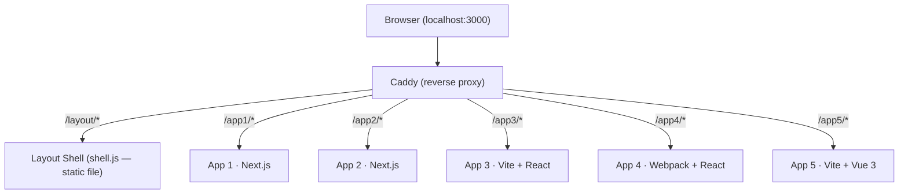

# How the applications work and how the layout is shared

## General architecture

```
Browser → Caddy (proxy) → /app1, /app2, /app3, /app4, /app5
                        → /layout/shell.js  (static file)
```

**Caddy** is the single entry point on port 3000. It routes requests by path prefix to each independent container, and serves the layout's `shell.js` directly as a static file.



---

## The contract between app and layout

Each application (regardless of framework) follows **three rules**:

### 1. Two elements in the HTML

```html
<div id="application-layout"></div>
<!-- where shell.js will mount -->
<div id="application-content"></div>
<!-- app content, initially hidden -->
```

`#application-content` starts with `display: none` to avoid a flash of content without layout.

### 2. `window.__APP_LAYOUT` defined **before** `shell.js` loads

```js
window.__APP_LAYOUT = {
  getLayoutTarget: () => document.getElementById("application-layout"),
  getContentTarget: () => document.getElementById("application-content"),
};
```

This object is the only communication point between the app and the shell. It is defined inline in the HTML, ensuring it is available when the layout script executes.

### 3. `shell.js` loaded at runtime as a `<script>`

```html
<script src="/layout/shell.js" type="module"></script>
```

It is not a build dependency — it is loaded only in the browser, like any external script. This keeps each app completely independent of the layout at build time.

---

## What `shell.js` does when it runs

Sequence executed in `layout/src/main.tsx`:

```
1. Reads window.__APP_LAYOUT
2. Gets a reference to #application-layout  (where it will mount)
3. Moves #application-content inside #application-layout
4. Mounts React root in #application-layout → renders <Layout>
5. <Layout> via useEffect re-inserts #application-content into the correct slot
6. Shows #application-content (display: block)
```

The resulting DOM looks like this:

```
#application-layout
  └── <header>  (topbar with navigation)
  └── <main>    (content slot)
        └── #application-content  ← app content goes here
  └── <footer>
```

---

## Why the layout does not interfere with the application

### Build decoupling

`shell.js` is compiled separately in the `layout/` folder and no app depends on it at build time. Each app is built completely independently — different frameworks, different tools (Next.js, Vite, Webpack), with no cross-dependencies.

### Runtime decoupling

The shell only _moves_ `#application-content` into the layout structure. It does not re-implement or replace the content. The app's React, Vue, or Next.js mounts normally inside the same DOM element — the shell is transparent to the app's framework.

### The timing problem and the solution

`shell.js` runs before the app's modules and temporarily _disconnects_ `#application-content` from the DOM during React's render (by moving the element and re-inserting it via `useEffect`). To handle this, each app uses a `MutationObserver` to wait for the element to be connected before mounting:

```ts
function waitAndMount() {
  const el = document.getElementById("application-content");
  if (el && el.isConnected) {
    mount(el);
    return;
  }

  const observer = new MutationObserver(() => {
    const target = document.getElementById("application-content");
    if (target && target.isConnected) {
      observer.disconnect();
      mount(target);
    }
  });
  observer.observe(document.body, { childList: true, subtree: true });
}
```

This ensures the app only mounts **after** the layout has put the element back in the DOM — no race condition and no direct coupling between the two.

---

## Full request flow

```
1. Browser accesses localhost:3000/app3
2. Caddy proxies to the app3 container
3. app3 responds with its HTML (contains #application-layout, #application-content and window.__APP_LAYOUT)
4. Browser loads /layout/shell.js (served by Caddy as a static file)
5. shell.js reads window.__APP_LAYOUT, moves the content and mounts React with topbar + footer
6. app3/src/main.tsx waits for #application-content to be connected to the DOM
7. app3 mounts its React/Vue/framework inside #application-content
8. User sees: topbar → app content → footer
```

---

## Summary

> Each app exposes two DOM elements and a `window.__APP_LAYOUT` object. `shell.js`, loaded at runtime as an external script, uses those two elements to wrap the app's content with a topbar and footer — without touching the code, build, or framework of any app.
